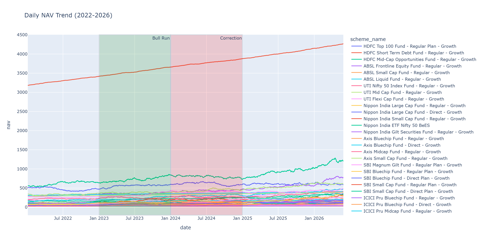
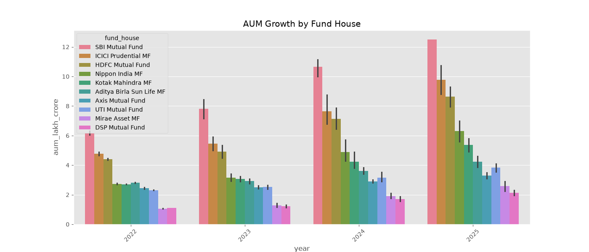
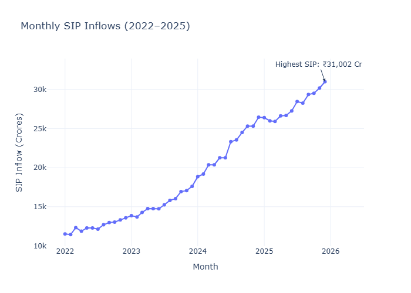
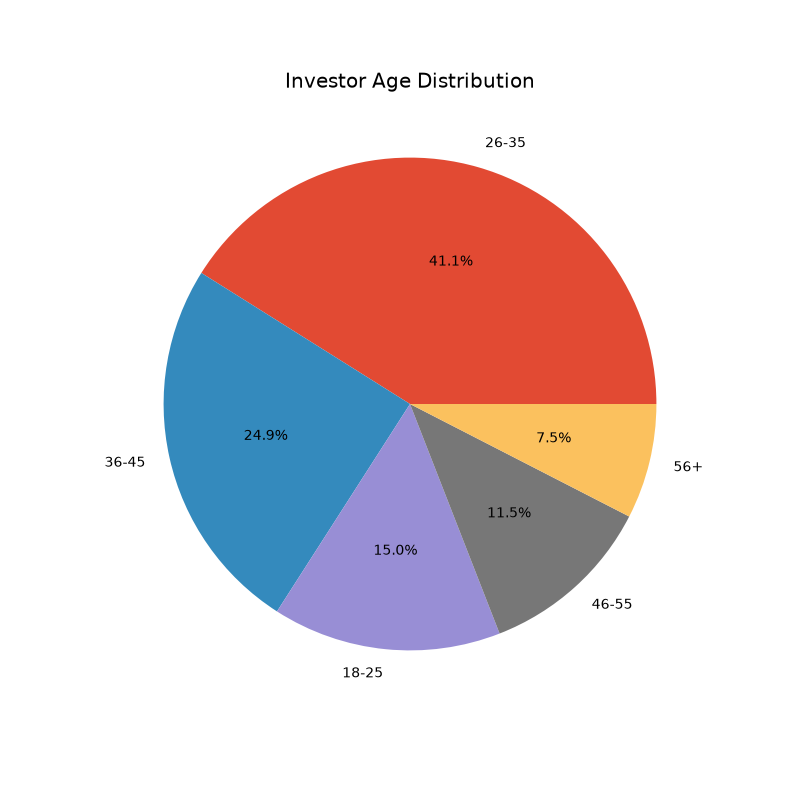
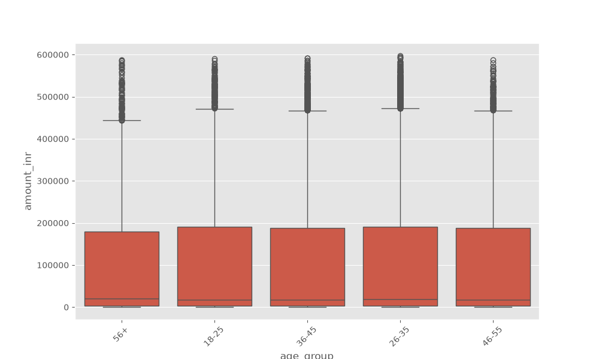
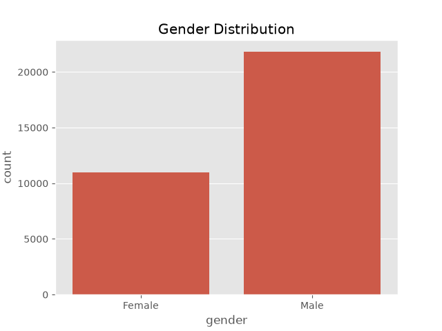
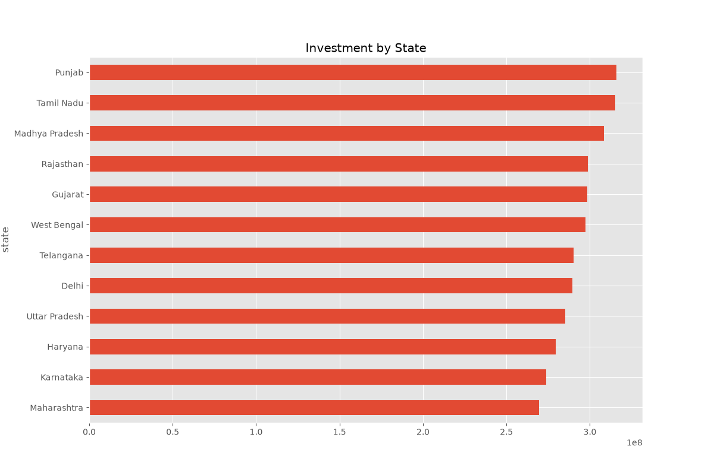
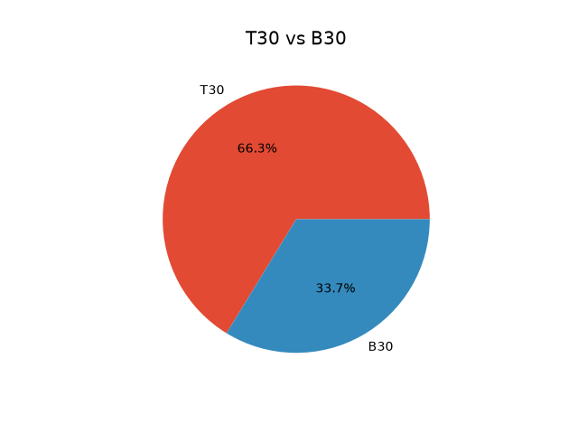
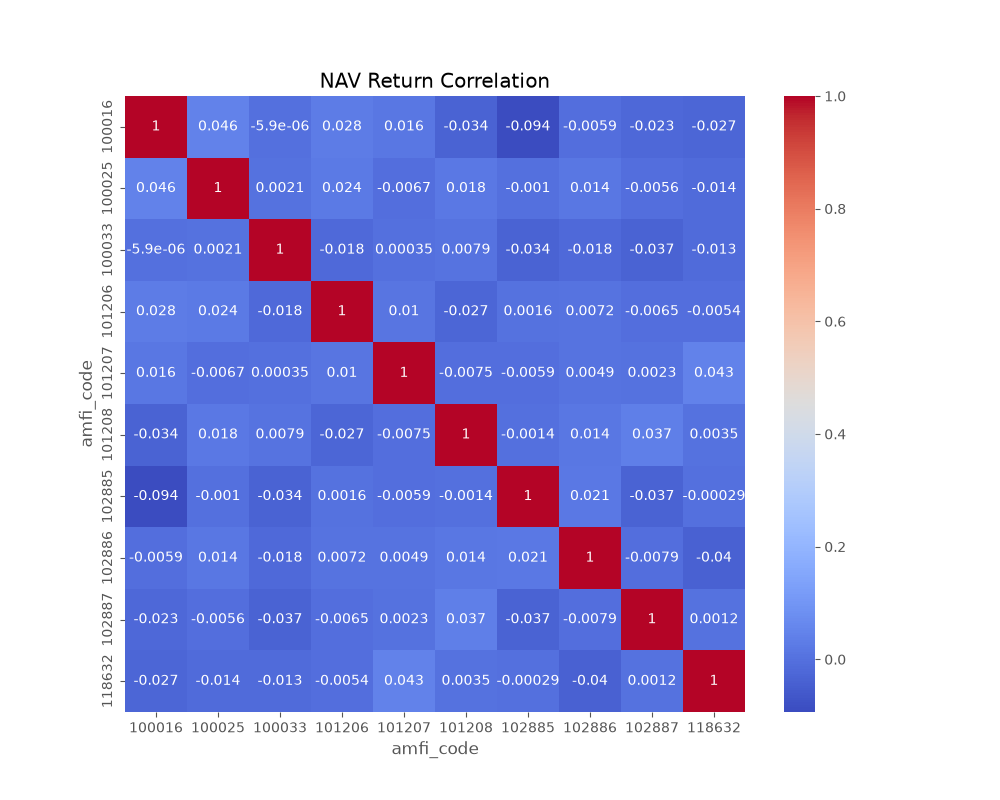
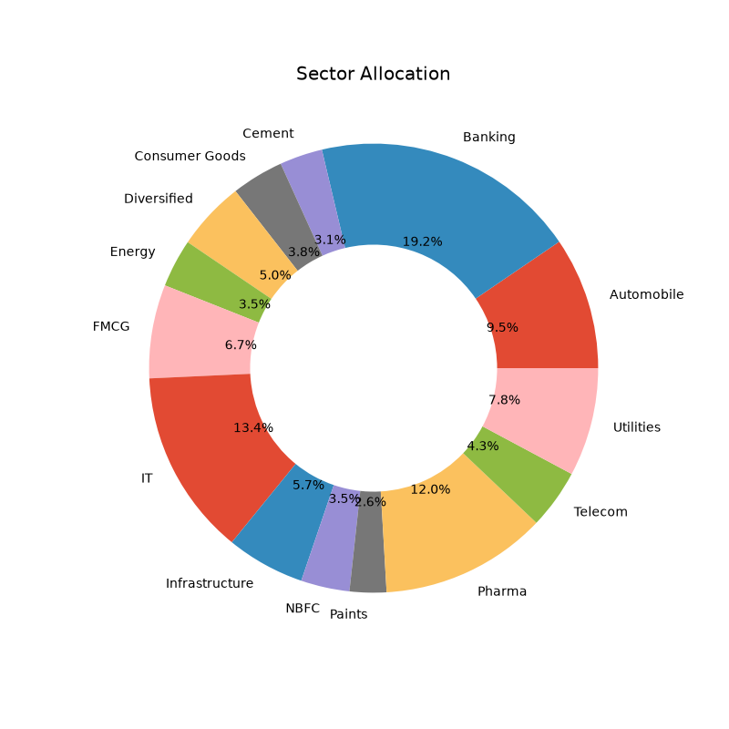

1.

Daily NAV increased steadily during 2023, indicating a broad market bull run.

2.

SBI Mutual Fund maintained the highest Assets Under Management across the study period.

3.

Monthly SIP inflows reached their highest value in December 2025.

4.

Most investors belong to the 26–35 age group.

5.

Median SIP amount increases with investor age.

6.

Male investors form a larger share of the sample than female investors.

7.

Maharashtra and Karnataka contribute the highest investment amounts.

8.

Industry folio counts show strong year-on-year growth from 2022 to 2025.

9.

The correlation heatmap indicates the relationship between daily returns of the selected mutual fund schemes. Most equity funds exhibit a positive correlation because they are influenced by similar market movements.

10.

Banking sector contributes highest sector allocation.